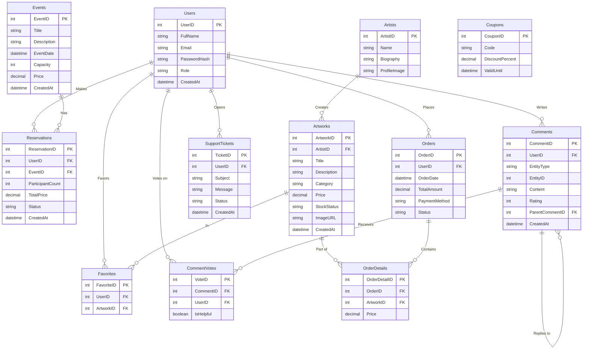

# Varlık-İlişki (E-R) Diyagramı

Ödev raporunda ("Veritabanı Tasarımının Sunulması") istenen E-R diyagramını aşağıda bulabilirsin. Bu görselleştirme, tabloların birbirlerine nasıl bağlandığını (Foreign Key ve One-to-Many / Many-to-Many yapılarını) göstermektedir. 

Raporuna eklemek için bu diyagramın ekran görüntüsünü alabilirsin.

## Diyagramdaki İlişkilerin Açıklaması (Raporuna Ekleyebilirsin)

*   **Users - Reservations (1:N):** Bir kullanıcı birden fazla etkinlik rezervasyonu yapabilir ancak bir rezervasyon tek bir kullanıcıya aittir.
*   **Users - Favorites - Artworks (N:M):** Çoktan çoğa bir ilişkidir. Bir kullanıcı birden fazla eseri favorileyebilir; bir eser birden fazla kullanıcı tarafından favorilenebilir. `Favorites` tablosu bu ilişkiyi bağlar.
*   **Artists - Artworks (1:N):** Bir sanatçının birden fazla eseri olabilir fakat bir eserin yalnızca tek bir sanatçısı vardır.
*   **Orders - OrderDetails - Artworks (1:N & N:1):** Bir sipariş içinde birden çok eser olabilir. `OrderDetails` (Sipariş Detayları) tablosu hangi siparişte hangi eserlerin olduğunu tutar.
*   **Comments - CommentVotes (1:N):** Bir yorum, birden fazla kullanıcıdan "Faydalı" oyu alabilir.
*   **Comments - Comments (1:N - Self Join):** Galerici bir yoruma yanıt verdiğinde, bu yanıt kendi içinde `Comments` tablosunda tutulur ancak `ParentCommentID` değeriyle asıl yoruma bağlanır.
