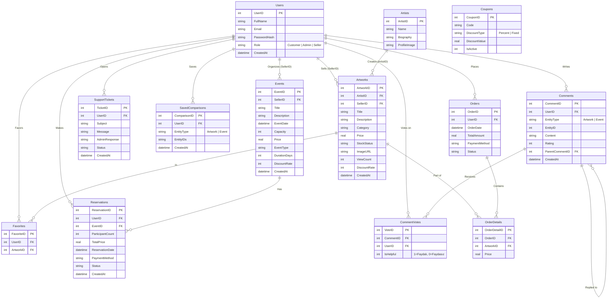

# Varlık-İlişki (E-R) Diyagramı

Aşağıdaki diyagram, projenin mevcut SQLite veritabanı şemasına göre hazırlanmıştır.

---

## İlişkilerin Açıklaması

| İlişki | Tür | Açıklama |
|--------|-----|----------|
| **Users → Artworks** (SellerID) | 1:N | Bir satıcı kullanıcı birden fazla eser ekleyebilir. |
| **Users → Events** (SellerID) | 1:N | Bir satıcı kullanıcı birden fazla etkinlik düzenleyebilir. |
| **Artists → Artworks** (ArtistID) | 1:N | Bir sanatçının birden fazla eseri olabilir. Eserler satıcı tarafından eklenirken bir sanatçıya atanabilir. |
| **Users → Reservations** | 1:N | Bir kullanıcı birden fazla etkinlik rezervasyonu yapabilir. |
| **Events → Reservations** | 1:N | Bir etkinliğin birden fazla rezervasyonu olabilir. |
| **Users ↔ Artworks** (Favorites) | N:M | Bir kullanıcı birden fazla eseri favorileyebilir; `Favorites` tablosu bu bağı kurar. |
| **Orders → OrderDetails → Artworks** | 1:N / N:1 | Bir sipariş birden çok eser içerebilir; `OrderDetails` ara tablodur. |
| **Comments → CommentVotes** | 1:N | Bir yorum birden fazla kullanıcıdan oy alabilir. |
| **Comments → Comments** (Self Join) | 1:N | Admin yanıtları `ParentCommentID` ile asıl yoruma bağlanır. |
| **Users → SavedComparisons** | 1:N | Kullanıcı, karşılaştırdığı eser/etkinlik gruplarını kaydedip sonradan tekrar açabilir. |
